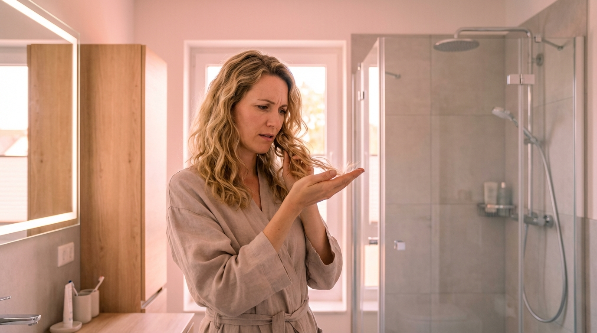

# Nach Deutschland gezogen — und plötzlich fallen die Haare aus

Du bist nach Deutschland gezogen. Neues Land, neues Leben, neue Chancen.

Und dann: Haare überall. In der Dusche. Auf dem Kissen. Im Kamm.

Das hattest du vorher nie. Deine Haare waren gut. Gesund. Normal.

Was zur Hölle ist hier los?

---

> **Kurz & knapp:** Haarausfall nach dem Umzug nach Deutschland? Hartes Leitungswasser ist oft der Grund. Kalk lagert sich auf der Kopfhaut ab, verstopft Follikel, macht Haare brüchig. Die Lösung: Ein Duschfilter, der die Auswirkungen von hartem Wasser reduziert. Lies weiter für alle Details.

---

## Inhaltsverzeichnis

1. [Der Schock: Haare, die plötzlich aufgeben](#der-schock-haare-die-plötzlich-aufgeben)
2. [Du bist nicht allein](#du-bist-nicht-allein)
3. [Was du wahrscheinlich schon versucht hast](#was-du-wahrscheinlich-schon-versucht-hast)
4. [Die überraschende Wahrheit](#die-überraschende-wahrheit)
5. [Was hartes Wasser mit deinen Haaren macht](#was-hartes-wasser-mit-deinen-haaren-macht)
6. [Der Selbsttest](#der-selbsttest)
7. [Die Lösung: Wasser filtern](#die-lösung-wasser-filtern)
8. [Was du zusätzlich tun kannst](#was-du-zusätzlich-tun-kannst)
9. [Wann zum Arzt](#wann-zum-arzt)
10. [FAQ](#faq)

---

## Der Schock: Haare, die plötzlich aufgeben

Es fing langsam an. Vielleicht hast du es zuerst ignoriert.

Dann wurden es mehr. Haare im Abfluss. Haare auf dem Handtuch. Haare, wo vorher keine waren.

Irgendwann kannst du es nicht mehr ignorieren: Du verlierst Haare. Richtig viele.

In Online-Foren schreiben Menschen genau das Gleiche. "Ich dachte, ich werde kahl." "Ich habe jetzt kahle Stellen." "Ich habe die Hälfte meiner Haare verloren, seit ich hier bin."

Das sind keine Übertreibungen. Das ist echte Verzweiflung.

Und du verstehst es nicht. Du warst gesund. Deine Haare waren okay. Und dann? Deutschland.

---

## Du bist nicht allein

Hier ist die Sache: Das passiert tausenden Menschen. Jedes Jahr.

Nicht nur dir. Nicht nur in deiner Stadt. In ganz Deutschland. In Österreich. In der Schweiz.

Menschen ziehen her, aus Asien, aus Südeuropa, aus Südamerika, aus den USA. Und nach ein paar Monaten fangen die Haare an zu fallen.

In Expat-Gruppen ist es ein Dauerthema. In Kommentarspalten taucht es immer wieder auf. Jemand zieht nach Deutschland. Verliert Haare. Fragt: Warum?

Freundinnen erzählen sich gegenseitig davon. "Bei mir auch." "Bei mir war es genauso." Das Muster ist eindeutig.

Und weißt du was? Leute aus anderen Ländern erkennen das Problem sofort. Ein Kommentar auf Tagalog brachte es auf den Punkt: "Vielleicht liegt's am Wasser." Einfach so. Aus der Ferne.

Die Antwort liegt näher, als du denkst.

---

## Was du wahrscheinlich schon versucht hast

Du hast nicht aufgegeben. Du hast gehandelt.

1. Shampoo gewechselt. Dreimal. Viermal. Irgendein teures "Anti-Haarausfall"-Produkt.
2. Nahrungsergänzungsmittel bestellt. Biotin. Zink. Eisen. Die volle Packung.
3. Zum Dermatologen gegangen. Blut abnehmen lassen. Kopfhaut untersucht.
4. Stress reduziert. Mehr geschlafen. Weniger Kaffee.
5. Vielleicht sogar Minoxidil probiert.

Und? Hat es geholfen?

Wahrscheinlich nicht. Oder nicht wirklich. Ein bisschen vielleicht. Aber das Problem ist geblieben.

Weil du an der falschen Stelle gesucht hast.

---

## Die überraschende Wahrheit

Hier kommt der Teil, den dir keiner erzählt.

Es liegt nicht an deinem Shampoo. Nicht an deiner Ernährung. Nicht an deinem Stress.

Es liegt am Wasser.

Klingt absurd? Ist aber so.

Deutsches Leitungswasser ist hart. Sehr hart. Voller Calcium und Magnesium. Das, was du als "Kalk" kennst.

Du siehst es überall. Im Wasserkocher. An den Armaturen. Auf den Glasduschwänden.

Dieser weiße Film? Der landet auch auf dir. Auf deiner Kopfhaut. Auf deinen Haaren. Bei jeder Dusche.

Und in deinem Heimatland? Wahrscheinlich war das Wasser weicher. Viel weicher.

Thailand, die Philippinen, Spanien, Portugal, Brasilien, viele Teile der USA: weicheres Wasser. Dein Haar hat es nie anders gekannt.

Und jetzt? Jetzt duschst du mit Wasser, das Rückstände hinterlässt.

Das ist der Unterschied. Das ist der Grund.

---

## Was hartes Wasser mit deinen Haaren macht

Stell dir vor, du wäschst deine Haare jeden Tag mit Kreidewasser.

Das passiert hier. Im übertragenen Sinn.

**Kalk lagert sich auf der Kopfhaut ab.** Schicht für Schicht. Bei jeder Dusche mehr. Die Haarfollikel verstopfen. Die Durchblutung leidet. Neue Haare haben es schwerer, nachzuwachsen.

**Deine Haare werden spröde.** Der Kalkfilm legt sich auf die Schuppenschicht. Entzieht Feuchtigkeit. Macht das Haar brüchig. Es bricht ab, bevor es lang werden kann.

**Chlor kommt obendrauf.** Deutsches Wasser enthält auch Chlor. Das trocknet zusätzlich aus. Reizt die Kopfhaut. Verschlimmert alles.

Das Ergebnis? Haarausfall. Spliss. Strohige Spitzen. Schuppen. Juckende Kopfhaut.

Und keine Menge teures Shampoo kann das reparieren. Weil du nach jeder Wäsche neuen Kalk aufträgst.

**Die Zahlen sprechen für sich:**

| Stadt | Wasserhärte |
|-------|-------------|
| München | 16°dH (hart) |
| Berlin | 14-25°dH (hart bis sehr hart) |
| Hamburg | 14°dH (hart) |
| Leipzig | 15-20°dH (hart) |

Zum Vergleich: Unter 8,4°dH gilt als weich. Die meisten deutschen Großstädte liegen weit darüber.

---

## Der Selbsttest

Bevor du irgendwas kaufst: Check das erstmal.

**1. Wasserhärte herausfinden**

Geh auf die Website deiner Stadtwerke. Such nach "Wasserhärte" oder "Wasserqualität". Die Zahl steht dort. Über 14°dH? Dein Wasser ist hart.

**2. Der Wasserkocher-Check**

Öffne deinen Wasserkocher. Siehst du weiße Ablagerungen am Boden? Je mehr Kalk, desto härter dein Wasser.

**3. Der Armatur-Check**

Schau dir deinen Wasserhahn an. Weiße Ränder? Trübe Flecken auf Glas? Das ist Kalk. Und der landet auch auf dir.

**4. Der Urlaubs-Test**

Denk nach: Waren deine Haare im Urlaub besser? Bei Besuchen in der Heimat? Wenn ja, liegt es sehr wahrscheinlich am Wasser.

**5. Die Timeline**

Wann fing es an? Ein paar Monate nach dem Umzug? Dann ist der Zusammenhang ziemlich klar.

---

## Die Lösung: Wasser filtern

Jetzt die gute Nachricht: Du musst nicht zurückziehen.

Die Lösung ist einfacher als du denkst.

**Ein Duschfilter.**

Das ist keine Wasserenthärtungsanlage. Die kostet tausende Euro und braucht einen Installateur. Für Mieter: unmöglich.

Ein Duschfilter? Den schraubst du in 5 Minuten zwischen Armatur und Schlauch. Kein Werkzeug. Kein Vermieter. Keine Genehmigung.

**Was der Filter macht:**

Er reduziert die Auswirkungen von hartem Wasser auf Haut und Haare. Filtert Chlor. Entfernt Schwermetalle. Das Wasser, das auf dich trifft, ist schonender.

Wichtig: Ein Duschfilter macht das Wasser nicht "weich". Er entfernt nicht komplett Calcium und Magnesium. Aber er schützt deine Haare und Kopfhaut vor den Ablagerungen.

**Was du merkst:**

Nach 2-4 Wochen: Haare fühlen sich weicher an. Weniger Juckreiz. Weniger Schuppen.

Nach 2-3 Monaten: Weniger Haarausfall. Die alten Ablagerungen sind rausgewaschen. Neue kommen nicht nach.

Manche berichten von Verbesserungen nach der ersten Wäsche. Es kommt auf den Einzelfall an.

**Die Kosten?** 30-80 Euro für einen guten Filter. Ersatzkartuschen alle 2-4 Monate für 15-30 Euro.

Vergleich: Weniger als eine Keratinbehandlung. Weniger als drei Monate Olaplex. Weniger als ein Dermatologenbesuch.

Und das Beste? Es löst das Problem an der Wurzel. Nicht nur die Symptome.

---

## Was du zusätzlich tun kannst

Der Duschfilter ist die Hauptlösung. Alles andere ist Unterstützung.

**Chelating-Shampoo einmal pro Woche**

Diese Shampoos entfernen Mineralablagerungen vom Haar. Gut, um bestehenden Kalk loszuwerden. Aber nicht als Dauerlösung. Ohne Filter legst du nach jeder Dusche neuen Kalk drauf.

**Letzte Spülung mit gefiltertem Wasser**

Nach dem Waschen: Eine Flasche gefiltertes oder destilliertes Wasser über die Haare. Spült letzte Reste weg. Ein Hack, wenn du (noch) keinen Duschfilter hast.

**Kopfhautpeeling gegen Ablagerungen**

Einmal pro Woche ein sanftes Kopfhautpeeling. Löst Kalk und tote Hautschüppchen. Verbessert die Durchblutung.

**Aber:**

Ohne Duschfilter ist das alles Sisyphusarbeit. Du wäschst den Kalk raus. Bei der nächsten Dusche landet neuer Kalk drauf.

Der Filter verhindert den Kalk von Anfang an.

---

## Wann zum Arzt

Wichtig: Nicht jeder Haarausfall kommt vom Wasser.

Geh zum Arzt, wenn:

1. Du büschelweise Haare verlierst
2. Du kahle Stellen bemerkst
3. Der Haarausfall extrem und plötzlich ist
4. Du andere Symptome hast (Müdigkeit, Gewichtsschwankungen, Hautveränderungen)

Das können Zeichen für Schilddrüsenprobleme, Eisenmangel, hormonelle Veränderungen oder andere Erkrankungen sein.

Hartes Wasser kann Haarausfall *verstärken* oder *auslösen*, aber es gibt auch andere Ursachen. Ein Arzt kann das abklären.

Dieser Artikel ersetzt keine medizinische Beratung. Bei anhaltenden Beschwerden wende dich an deinen Arzt.

Aber wenn dein Arzt nichts findet? Und deine Haare trotzdem ausfallen? Dann ist es Zeit, das Wasser zu checken.

---

## FAQ

### Hilft ein Duschfilter wirklich?

Ja. Wenn hartes Wasser das Problem ist. Der Filter reduziert Kalk und Chlor. Dein Haar bekommt keine neuen Ablagerungen. Die alten wäschst du mit der Zeit aus.

### Wie schnell sehe ich Ergebnisse?

Die meisten bemerken nach 2-4 Wochen einen Unterschied. Haare fühlen sich weicher an, weniger Juckreiz. Für spürbaren Unterschied beim Haarausfall: 2-3 Monate. Haare müssen nachwachsen.

### Ist deutsches Wasser gefährlich?

Nein. Deutsches Leitungswasser ist trinkbar und sicher. Es ist nur hart. Das ist kein Gesundheitsrisiko, aber schlecht für Haare und Haut.

### Kann ich auch nur das Shampoo wechseln?

Shampoo-Wechsel allein löst das Problem nicht. Du wäschst mit dem neuen Shampoo, spülst mit kalkhaltigem Wasser. Der Kalk bleibt. Ein "Hard Water"-Shampoo kann helfen, aber ohne Filter kämpfst du gegen Windmühlen.

### Meine Freundin hat keine Probleme. Warum ich?

Verschiedene Haartypen reagieren unterschiedlich. Feines Haar leidet stärker. Lockiges Haar auch. Manche Menschen sind empfindlicher als andere. Das macht dein Problem nicht weniger real.

### Wie lang dauert es, bis meine Haare sich erholen?

Das kommt auf den Schaden an. Bei leichten Fällen: Wochen. Bei stärkeren: Monate. Haare wachsen etwa 1 cm pro Monat. Gib deinem Körper Zeit.

---

## Dein Haar kann sich erholen

Hier ist die gute Nachricht: Es ist nicht permanent.

Tausende Expats haben das durchgemacht. Und viele haben ihre Haare zurückbekommen.

Der erste Schritt: Verstehen, woran es liegt. Das weißt du jetzt.

Der zweite Schritt: Handeln. Ein Duschfilter ist der einfachste, günstigste, effektivste Weg.

Die Timeline? 4-8 Wochen für erste Verbesserungen. Ein paar Monate für echte Erholung.

Du warst nicht schuld. Du hast nichts falsch gemacht. Du bist nur in ein Land mit hartem Wasser gezogen.

Jetzt weißt du, woran es liegt. Und was du tun kannst.

---

*Auch interessant: [Haare wachsen nicht mehr?](/haare-wachsen-nicht-mehr-vielleicht-liegt-es-am-wasser/) — Wenn die Länge einfach nicht kommt. Oder: [Dyson Airwrap und trotzdem kaputte Haare?](/dyson-airwrap-und-trotzdem-kaputte-haare/) — Warum auch teure Geräte gegen Kalk nicht helfen.*
